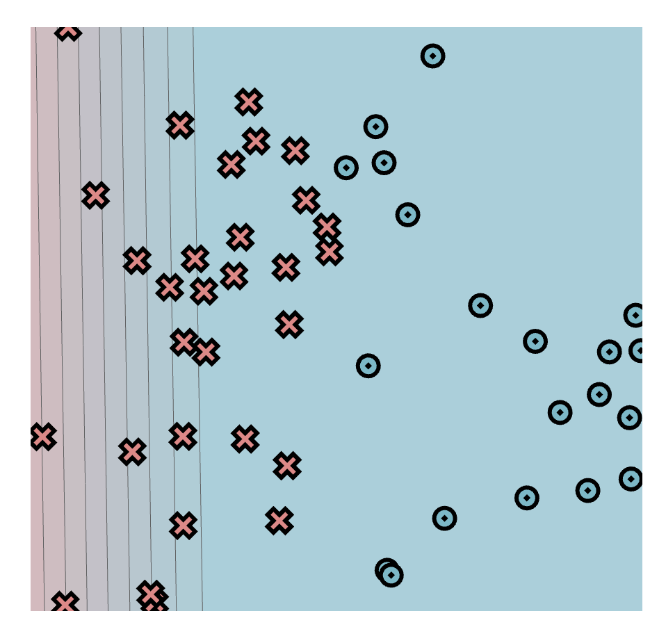
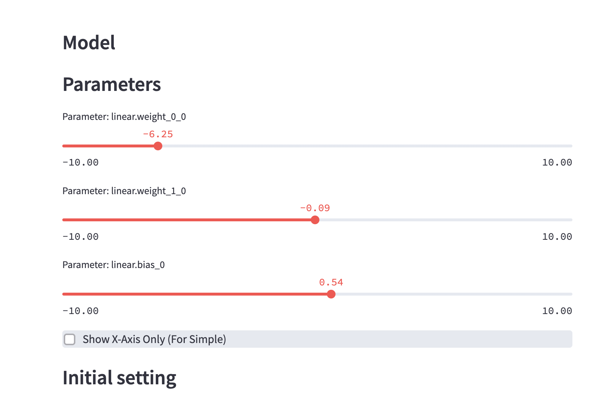

# MiniTorch Module 0

Ручная модель на Simple. Веса: `-6.25`, `-0.09`, bias: `0.54`.
Граница ушла слишком далеко влево.

Надо переснять с весами `-10`, `0` и bias `5`, чтобы граница была посередине.
